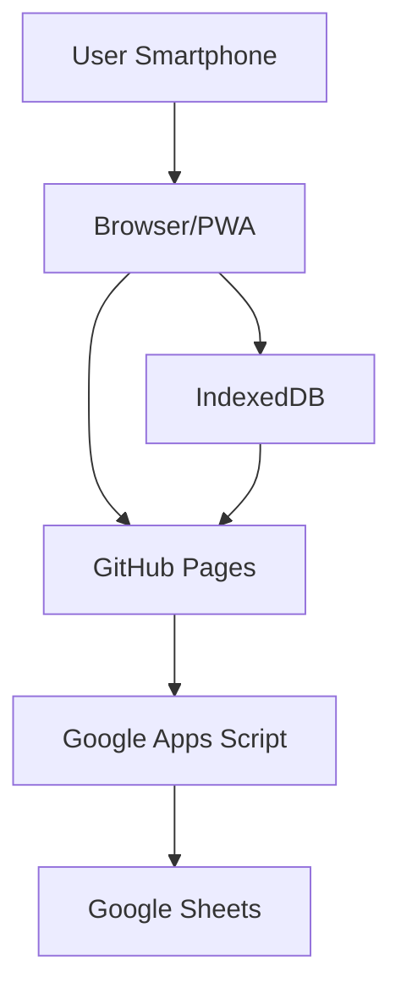

# Sistem Digital Jimpitan Desa

<div align="center">


**Sistem pencatatan jimpitan, hutang, deposit, jadwal petugas, kas, dan laporan keuangan desa**

</div>

---

## 📋 Daftar Isi

- [Tentang Aplikasi](#tentang-aplikasi)
- [Fitur Utama](#fitur-utama)
- [Arsitektur Sistem](#arsitektur-sistem)
- [Role Pengguna](#role-pengguna)
- [Struktur Database](#struktur-database)
- [Prasyarat](#prasyarat)
- [Instalasi](#instalasi)
- [Konfigurasi](#konfigurasi)
- [Penggunaan](#penggunaan)
- [Aturan Bisnis](#aturan-bisnis)
- [Keamanan](#keamanan)
- [Offline Mode](#offline-mode)
- [Riwayat Perubahan](#riwayat-perubahan)
- [Pengembangan](#pengembangan)
- [Lisensi](#lisensi)
- [Kontak](#kontak)

---

## 🏠 Tentang Aplikasi

Sistem Digital Jimpitan Desa adalah aplikasi web progresif (PWA) yang dirancang untuk mengotomatisasi proses pencatatan jimpitan (iuran rutin warga desa). Aplikasi ini menggantikan metode manual menggunakan buku dengan sistem digital yang terintegrasi.

### Latar Belakang

Program jimpitan merupakan kegiatan pengumpulan iuran rutin warga desa. Setiap rumah warga memiliki kewajiban membayar jimpitan berdasarkan tarif yang berlaku (misalnya Rp500 per hari). Sistem manual memiliki banyak permasalahan:

- Pencatatan manual rawan salah
- Petugas berbeda setiap hari
- Sulit mengetahui hutang setiap warga
- Deposit warga harus dihitung manual
- Perubahan tarif berpotensi merusak histori
- Laporan harus direkap manual
- Histori tahunan sulit dikelola

Aplikasi ini hadir untuk menyelesaikan semua permasalahan tersebut.

---

## ✨ Fitur Utama

### 1. Manajemen Warga
- CRUD data warga
- Nomor rumah unik
- Status aktif/nonaktif — **bisa diedit langsung** dari form Data Warga (bukan hanya lewat aksi nonaktifkan terpisah)
- Histori tetap tersimpan

### 2. Manajemen User
- Menu khusus admin, terletak di samping menu Data Warga
- Nama akun diambil dari **pencarian live (live search)** ke data Warga, bukan input manual — mencegah typo dan data ganda
- Kalau warga yang dipilih sudah punya akun, form otomatis terisi (mode edit); kalau belum, form kosong siap dipakai membuat akun baru
- Sinkronisasi dua arah otomatis antara sheet USERS dan WARGA

### 3. Jadwal Otomatis
- Generate jadwal satu tahun penuh
- Sistem rotasi round-robin
- Regenerate jadwal dari tanggal tertentu
- Jadwal permanen per tahun
- Status jadwal otomatis: `TERJADWAL` → `TERLAKSANA` (begitu ada yang menyelesaikan catat jimpitan hari itu, baik warga sendiri maupun admin/bendahara yang mewakili) atau `ABSEN` (ditandai manual oleh admin)
- Menu **Pengaturan Masa Edit** (admin): menentukan berapa lama warga masih boleh mengedit catatan jimpitan hari-hari sebelumnya — pilihan **Harian** (isi jumlah hari), **Bulanan** (isi jumlah bulan, maks. 12), atau **Selamanya** (tanpa batas)

### 4. Pencatatan Jimpitan
- Validasi petugas berdasarkan jadwal
- Centang semua / hapus semua
- Live search warga
- Read-only mode untuk bukan petugas
- Validasi backend (bukan hanya frontend)
- **Admin & Bendahara bisa mencatat/mengedit jimpitan kapan saja**, mewakili warga mana pun, tanpa terikat jadwal petugas maupun Pengaturan Masa Edit
- **Warga** boleh mengedit hari ini bebas; untuk hari-hari sebelumnya **hanya bisa UPDATE** catatan yang sudah ada (tidak bisa membuat catatan baru secara retroaktif kalau lupa klik Selesai), dan hanya dalam rentang Pengaturan Masa Edit. Di luar itu, muncul **popup "Hubungi Admin/Bendahara"**
- Tidak seorang pun (termasuk admin/bendahara) bisa mencatat untuk tanggal yang **belum terjadi**
- Kolom **Saldo Deposit** per warga tampil di tabel, dan checkbox bayar **otomatis tercentang** kalau saldo deposit warga sudah cukup menutup tarif hari itu
- **Ringkasan** otomatis di bawah tabel (real-time saat centang/isian diubah): Total Semua Warga, Total Warga Bayar, Total Seharusnya Didapat, Tambahan Deposit, Total Hutang Jimpitan, Total Setoran Jimpitan
- Tombol **Unduh Bukti Tugas Selesai (JPG)** setelah klik Selesai — menghasilkan gambar portrait 1080×1920 (pas untuk story WhatsApp/Instagram) berisi ucapan terima kasih ke petugas dan rincian tugas hari itu
- Tombol **Ubah** untuk membuka kunci form lagi setelah data disimpan (data terkunci otomatis pasca "Selesai" supaya tidak tersimpan berulang tanpa sengaja)

### 5. Hutang
- Pencatatan hutang otomatis
- Pembayaran hutang dengan metode **FIFO** (melunasi hutang paling lama dulu)
- Pembayaran sebagian (PARTIAL)
- **Kalau jumlah bayar melebihi total hutang, kelebihannya otomatis masuk sebagai saldo deposit** (bukan ditolak sebagai error)
- Hutang lintas tahun (carry forward) — dihitung otomatis dari sisa hutang riil, bukan nilai kosong
- **Menu Bayar Hutang**, tersedia untuk admin & bendahara: cari warga lewat live search, ID & nomor rumah otomatis tampil, isi tanggal bayar/kepada siapa/nominal, dan tabel riwayat pembayaran

### 6. Deposit
- Pencatatan deposit masuk selalu dianggap **setoran baru** (bukan total kumulatif) — warga sudah punya saldo Rp5.000 lalu setor Rp3.000 lagi, petugas cukup isi "3000", sistem menampilkan total Rp8.000
- Setoran deposit **otomatis dialokasikan**: melunasi hutang jimpitan paling lama dulu, sisanya baru masuk saldo deposit untuk dipakai ke hari-hari berikutnya
- Penggunaan deposit otomatis untuk membayar tarif hari berjalan kalau saldo mencukupi
- Saldo deposit real-time, tidak bisa negatif
- Saldo deposit ikut dibawa (carry forward) ke tahun berikutnya saat tutup tahun

### 7. Tarif
- Tarif berdasarkan tanggal aktif
- Snapshot tarif per transaksi
- Perubahan tarif tidak merusak histori

### 8. Kas & Penarikan
- Saldo kas otomatis dari transaksi
- Penarikan kas oleh bendahara/admin
- Penerima harus dari database warga
- Validasi saldo cukup

### 9. Laporan
- Laporan bulanan, tahunan, custom range
- Ringkasan keuangan
- Laporan hutang & deposit
- Cetak PDF

### 10. Offline Mode
- Draft tersimpan di IndexedDB
- Retensi 48 jam
- Recovery setelah HP mati
- Sinkronisasi otomatis

### 11. Audit Trail
- Pencatatan semua aktivitas penting, menyertakan **nama pelaku** (bukan cuma ID) supaya langsung terbaca tanpa perlu cek silang ke sheet USERS
- Log koreksi
- Riwayat login
- Tidak bisa dihapus

### 12. Multi-Tahun
- Sheet terpisah per tahun
- Opening balance otomatis untuk **kas, hutang, dan deposit**
- Histori tidak berubah
- Saldo carry forward

### 13. Monitoring & Statistik
- Statistik Petugas: total jadwal, jumlah berhasil, jumlah absen per warga — dihitung dari status jadwal riil (`TERLAKSANA`/`ABSEN`)
- Statistik pembayaran & hutang per warga

### 14. Informasi Warga (Publik, Tanpa Login)
- Tab kedua di halaman login, di samping tab "Masuk"
- Menampilkan: Total Warga aktif, siapa petugas hari ini, persentase kehadiran bulan berjalan, dan tabel jadwal 10 hari ke depan
- Tidak menampilkan data keuangan/pribadi apa pun — aman diakses siapa saja tanpa login

### 15. Riwayat Tugas dengan Highlight Warna
- Di halaman Akun warga, riwayat tugas ditandai warna: **kuning** (Terjadwal), **merah** (Absen), **hijau** (Berhasil)

### 16. Keamanan & Keandalan
- Password hashing (PBKDF2-style)
- Session token
- Rate limiting login
- Role-based access control
- HTTPS
- **Proteksi klik ganda**: pengunci proses (LockService) mencegah transaksi tercatat dua kali kalau tombol Selesai/Simpan terpencet berkali-kali atau koneksi lambat
- **Zona waktu eksplisit (Asia/Jakarta)** untuk semua perbandingan tanggal, mencegah tanggal bergeser satu hari

---

## 🏗 Arsitektur Sistem



### Teknologi yang Digunakan

| Komponen | Teknologi | Keterangan |
|----------|-----------|------------|
| Frontend | HTML, CSS, JavaScript | Responsive, Mobile First |
| Backend | Google Apps Script | API endpoint |
| Database | Google Sheets | Penyimpanan data |
| Offline Storage | IndexedDB | Draft lokal 48 jam |
| Hosting | GitHub Pages | Gratis |
| PWA | Service Worker + Manifest | Installable |
| Gambar Bukti Tugas | Canvas API (client-side) | Generate JPG langsung di browser, tanpa server tambahan |

---

## 👥 Role Pengguna

> **Catatan istilah:** role `USER` di database sekarang **ditampilkan sebagai "WARGA"** di seluruh antarmuka (nilai di database sengaja tidak diganti, supaya tidak perlu migrasi data — hanya label tampilannya yang disesuaikan).

| Role (DB) | Label Tampilan | Deskripsi | Akses Utama |
|-----------|-----------------|-----------|-------------|
| **USER** | WARGA | Warga/petugas jimpitan | Lihat data pribadi, catat/update jimpitan sesuai jadwal & masa edit |
| **BENDAHARA** | BENDAHARA | Pengelola keuangan | Kelola kas, tarik kas, bayar hutang, laporan, **catat jimpitan mewakili siapa pun** |
| **ADMIN** | ADMIN | Pengelola sistem | Semua akses termasuk master data, manajemen user, pengaturan masa edit, dan monitoring |

### Matriks Hak Akses

| Fitur | Warga | Bendahara | Admin |
|-------|-------|-----------|-------|
| Home/Dashboard | ✓ | ✓ | ✓ |
| Informasi Warga (publik) | ✓ (tanpa login) | ✓ (tanpa login) | ✓ (tanpa login) |
| Catat Jimpitan | ✓* | ✓** | ✓** |
| Lihat Deposit | ✓ | ✓ | ✓ |
| Lihat Hutang | ✓ | ✓ | ✓ |
| Bayar Hutang | - | ✓ | ✓ |
| Tarik Kas | - | ✓ | ✓ |
| Laporan | - | ✓ | ✓ |
| Data Warga | - | - | ✓ |
| Manajemen User | - | - | ✓ |
| Kelola Jadwal | - | - | ✓ |
| Kelola Tarif | - | - | ✓ |
| Pengaturan Masa Edit | - | - | ✓ |
| Monitoring | - | - | ✓ |
| Audit Log | - | - | ✓ |

\* Warga hanya bisa mencatat/update pada tanggal jadwalnya sendiri, dan untuk hari-hari lampau dibatasi Pengaturan Masa Edit (hanya update, tidak bisa membuat catatan baru).
\** Admin & Bendahara bebas mencatat/mengedit kapan saja, mewakili siapa pun, tanpa terikat jadwal petugas maupun batas masa edit (tapi tetap tidak bisa untuk tanggal yang belum terjadi).

---

## 📊 Struktur Database

### Google Sheets Structure

```
JIMPITAN_DB
│
├── CONFIG              # Konfigurasi sistem (termasuk Pengaturan Masa Edit)
├── USERS               # Data pengguna
├── WARGA               # Data warga
├── TARIF                # Data tarif
├── SALDO_TAHUNAN       # Saldo per tahun
│
├── JADWAL_2026         # Jadwal tahun 2026
├── TRANSAKSI_2026      # Transaksi tahun 2026
├── AUDIT_LOG_2026      # Audit log 2026
│
├── JADWAL_2027         # Jadwal tahun 2027
├── TRANSAKSI_2027      # Transaksi tahun 2027
├── AUDIT_LOG_2027      # Audit log 2027
│
└── ...                 # Tahun berikutnya
```

### Tabel Utama

**USERS**: user_id, username, password_hash, salt, password_iterations, role, warga_id, status, created_at, updated_at, last_login

**WARGA**: warga_id, nama, nomor_rumah, user_id, status, created_at, updated_at

**TARIF**: tarif_id, tanggal_aktif, nominal, created_by, created_at

**JADWAL_YYYY**: jadwal_id, tanggal, warga_id, nama_snapshot, status (`TERJADWAL` / `TERLAKSANA` / `ABSEN`), created_at, updated_at

**TRANSAKSI_YYYY** *(skema diperbarui — 2 kolom baru)*: transaksi_id, tanggal, waktu, warga_id, **nama_warga**, petugas_id, **nama_petugas**, jenis, status, nominal, tarif_id, tarif_snapshot, debt_id, referensi_id, source_year, source_transaction_id, idempotency_key, keterangan, created_by, created_at, updated_at, version

**AUDIT_LOG_YYYY** *(skema diperbarui — 1 kolom baru)*: audit_id, timestamp, user_id, **nama_user**, action, object_type, object_id, old_value, new_value, reason

> Kolom `nama_warga`, `nama_petugas`, dan `nama_user` ditambahkan supaya data mentah di sheet enak dibaca manusia langsung tanpa perlu buka sheet WARGA/USERS untuk mencocokkan ID. Diisi otomatis oleh backend, tidak perlu diisi manual.

### Jenis Transaksi

| Jenis | Deskripsi |
|-------|-----------|
| JIMPITAN_PAID | Pembayaran jimpitan lunas |
| JIMPITAN_HUTANG | Pencatatan hutang jimpitan |
| DEPOSIT_MASUK | Deposit warga masuk (selalu berupa setoran baru, dialokasikan otomatis) |
| DEPOSIT_PAKAI | Deposit digunakan untuk bayar tarif hari berjalan |
| HUTANG_PAYMENT | Pembayaran hutang (FIFO, oldest-first) |
| TARIK_KAS | Penarikan kas |
| OPENING_BALANCE_KAS | Saldo awal tahun — kas |
| OPENING_BALANCE_HUTANG | Saldo awal tahun — sisa hutang warga yang belum lunas |
| OPENING_BALANCE_DEPOSIT | Saldo awal tahun — sisa saldo deposit warga |
| KOREKSI | Koreksi transaksi |

---

## 📦 Prasyarat

### Akun Google
- Akun Google untuk Google Sheets dan Apps Script
- Google Drive untuk penyimpanan

### GitHub
- Akun GitHub untuk hosting frontend
- Git terinstall di komputer (opsional, bisa upload manual)

### Browser
- Chrome/Firefox/Safari terbaru
- Mendukung IndexedDB
- Mendukung PWA (untuk install)
- Mendukung Canvas API (untuk fitur unduh Bukti Tugas JPG — didukung semua browser modern)

---

## 🔧 Instalasi

### Langkah 1: Setup Google Sheets

1. Buka [Google Sheets](https://sheets.google.com)
2. Buat spreadsheet baru dengan nama `JIMPITAN_DB`
3. Buat sheet berikut:
   - CONFIG
   - USERS
   - WARGA
   - TARIF
   - SALDO_TAHUNAN
   - JADWAL_2026
   - TRANSAKSI_2026
   - AUDIT_LOG_2026

4. Isi header kolom sesuai [Struktur Database](#struktur-database) — **pastikan `TRANSAKSI_YYYY` dan `AUDIT_LOG_YYYY` memakai skema terbaru** (dengan kolom `nama_warga`, `nama_petugas`, `nama_user`) kalau membuat sheet baru dari nol.

### Langkah 2: Setup Google Apps Script

1. Buka spreadsheet → **Extensions** → **Apps Script**
2. Hapus kode default
3. Buat file-file berikut:
   - `Code.gs`
   - `Utils.gs`
   - `Auth.gs`
   - `User.gs`
   - `Warga.gs`
   - `Tarif.gs`
   - `Jadwal.gs`
   - `Transaksi.gs`
   - `Deposit.gs`
   - `Hutang.gs`
   - `Kas.gs`
   - `Laporan.gs`
   - `Monitoring.gs`
   - `Tahun.gs`
   - `Audit.gs`
   - `Pengaturan.gs` — logika Pengaturan Masa Edit
   - `InfoPublik.gs` — endpoint publik tanpa login untuk tab Informasi Warga
   - `appsscript.json` — menetapkan timezone `Asia/Jakarta` secara eksplisit; wajib ada supaya semua perbandingan tanggal konsisten

4. Salin kode dari folder `backend/` (atau `gs/`) di repository ini

### Langkah 3: Deploy Apps Script

1. Klik **Deploy** → **New deployment**
2. Pilih **Web app**
3. Description: `Jimpitan API`
4. Execute as: **Me**
5. Who has access: **Anyone**
6. Klik **Deploy**
7. Salin URL Web App (misal: `https://script.google.com/macros/s/XXXX/exec`)

> **Penting untuk update berikutnya:** setelah deployment pertama ini dibuat, setiap kali ada perubahan kode, gunakan **Deploy → Manage deployments → edit (ikon pensil) → New version**, BUKAN "New deployment". Membuat deployment baru akan menghasilkan URL `/exec` yang berbeda, sehingga frontend yang sudah terlanjur pakai URL lama tidak akan mendapat kode terbaru.

### Langkah 4: Setup Frontend

1. Clone atau download repository ini
2. Buka `assets/js/api.js`
3. Ganti `YOUR_SCRIPT_ID` dengan ID dari URL Web App:

```javascript
const API_URL = 'https://script.google.com/macros/s/YOUR_SCRIPT_ID/exec';
```

> Gunakan URL `/exec` apa adanya. Jangan pernah menaruh URL `script.googleusercontent.com/macros/echo?...` (URL redirect internal Apps Script) di sini — URL tersebut tidak stabil dan bisa menyebabkan error yang terlihat seperti masalah CORS.

### Langkah 5: Buat User Admin

1. Buka Apps Script editor
2. Jalankan fungsi ini di editor:

```javascript
function createFirstAdmin() {
  const password = 'admin123'; // Ganti dengan password aman
  const result = hashPassword(password, Utilities.getUuid(), 10000);
  console.log('Salt:', result.salt);
  console.log('Hash:', result.hash);
  console.log('Iterations:', result.iterations);
}
```

3. Lihat hasil di Console
4. Masukkan ke sheet USERS secara manual:
   - user_id: `U-ADMIN-001`
   - username: `admin`
   - password_hash: (hasil hash)
   - salt: (hasil salt)
   - password_iterations: 10000
   - role: `ADMIN`
   - warga_id: (kosongkan, atau isi kalau admin juga warga)
   - status: `ACTIVE`

### Langkah 6: Hosting di GitHub Pages

1. Buat repository di GitHub
2. Upload semua file frontend
3. Buka **Settings** → **Pages**
4. Source: **Deploy from branch** → `main`
5. Folder: `/ (root)`
6. Klik **Save**
7. Akses aplikasi di `https://username.github.io/repo-name/`

---

## ⚙️ Konfigurasi

### Sheet CONFIG

| Key | Value | Deskripsi |
|-----|-------|-----------|
| `nama_desa` | Desa Sukamaju | Nama desa |
| `tarif_default` | 500 | Tarif default |
| `session_timeout` | 6 | Timeout session (jam) |
| `draft_retention` | 48 | Retensi draft offline (jam) |
| `max_login_attempts` | 5 | Maksimal percobaan login |
| `masa_edit_tipe` | `HARI` / `BULANAN` / `SELAMANYA` | Tipe batas masa edit catat jimpitan untuk warga |
| `masa_edit_nilai` | 3 | Jumlah hari/bulan (kosongkan kalau `SELAMANYA`) — juga bisa diatur lewat menu **Pengaturan Masa Edit** di admin, tidak perlu edit sheet langsung |

### PWA Manifest

File `manifest.json` berisi konfigurasi PWA:

```json
{
  "name": "Jimpitan Desa",
  "short_name": "Jimpitan",
  "theme_color": "#4CAF50",
  "background_color": "#ffffff",
  "display": "standalone"
}
```

---

## 📱 Penggunaan

### Pengunjung (Tanpa Login)

Halaman login (`index.html`) punya 2 tab:
- **Masuk** — form login biasa
- **Informasi Warga** — info publik: total warga, siapa petugas hari ini, persentase kehadiran bulan berjalan, dan jadwal 10 hari ke depan. Tidak perlu login untuk melihat tab ini.

### Warga

1. **Login** dengan username dan password — tersedia opsi **Ingat Saya** dan tombol lihat/sembunyikan password
2. **Dashboard** menampilkan saldo deposit, hutang, dan **Jadwal Terdekat** (termasuk jadwal hari ini sendiri)
3. **Catat Jimpitan** aktif pada tanggal jadwal sendiri; hari-hari lampau hanya bisa diupdate (bukan dibuat baru) selama masih dalam Pengaturan Masa Edit
4. **Akun** untuk melihat nomor rumah, saldo, dan riwayat tugas (dengan highlight warna: kuning=Terjadwal, merah=Absen, hijau=Berhasil)

### Bendahara

1. **Dashboard** menampilkan saldo kas, total hutang, total deposit
2. **Catat Jimpitan** — bisa mencatat/mengedit mewakili warga mana pun, kapan saja
3. **Tarik Kas** untuk pengeluaran
4. **Bayar Hutang** dengan FIFO, kelebihan bayar otomatis jadi deposit
5. **Laporan** untuk cetak keuangan

### Admin

1. **Data Warga** untuk CRUD warga, termasuk edit status langsung
2. **Manajemen User** untuk kelola akun, dengan pencarian warga live search
3. **Catat Jimpitan** — akses sama seperti bendahara
4. **Jadwal** untuk generate jadwal tahunan
5. **Tarif** untuk mengubah tarif
6. **Bayar Hutang**
7. **Pengaturan Masa Edit** untuk menentukan batas edit warga
8. **Monitoring** untuk statistik petugas (total jadwal, berhasil, absen) dan statistik warga
9. **Audit Log** untuk melihat aktivitas (menampilkan nama pelaku)

---

## 📏 Aturan Bisnis

### Jadwal
- Satu tanggal memiliki maksimal satu petugas
- Jadwal dibuat satu tahun penuh
- Round-robin berdasarkan urutan warga
- Absen tidak menggeser jadwal
- Regenerate hanya untuk tanggal masa depan
- Status jadwal otomatis berubah jadi `TERLAKSANA` begitu ada yang berhasil menyelesaikan catat jimpitan hari itu (baik warga terjadwal sendiri maupun admin/bendahara yang mewakili — termasuk kalau sebelumnya sempat ditandai `ABSEN`)

### Jimpitan
- Admin & Bendahara bebas mencatat/mengedit jimpitan kapan saja, mewakili siapa pun, tidak terikat jadwal petugas maupun Pengaturan Masa Edit
- Warga hanya bisa input pada jadwal sendiri; hari ini bebas dicatat/diupdate, hari lampau **hanya bisa diupdate** (tidak bisa membuat catatan retroaktif) dan dibatasi Pengaturan Masa Edit
- Tidak seorang pun bisa mencatat untuk tanggal masa depan
- Klik tombol Selesai berkali-kali (atau klik ganda tidak sengaja) **tidak akan menggandakan transaksi** — dilindungi pengunci proses (LockService) dan logika upsert per hari
- Setelah "Selesai" diklik, form otomatis terkunci; tombol **Ubah** dipakai untuk membuka kunci lagi kalau perlu koreksi
- Backend memvalidasi (bukan hanya frontend)

### Tarif
- Perubahan tarif tidak mengubah transaksi lama
- Setiap transaksi menyimpan snapshot tarif
- Tarif aktif berdasarkan tanggal

### Deposit
- Saldo deposit tidak boleh negatif
- Setiap setoran deposit yang diinput dianggap **jumlah baru** (bukan total kumulatif) — sistem yang menjumlahkan ke saldo yang sudah ada
- Setoran deposit dialokasikan otomatis: **melunasi hutang jimpitan paling lama dulu**, sisanya baru masuk saldo deposit
- Deposit digunakan otomatis untuk pembayaran tarif hari berjalan kalau saldo mencukupi
- Dihitung dari transaksi (bukan input manual)

### Hutang
- Pembayaran menggunakan FIFO (oldest-first)
- Pembayaran sebagian diperbolehkan (status `PARTIAL`)
- **Kalau jumlah bayar melebihi total hutang, kelebihannya otomatis jadi saldo deposit** (bukan ditolak/error)
- Hutang lintas tahun melalui opening balance, dihitung dari sisa hutang riil setiap warga
- Tidak bisa membayar kalau warga tidak punya hutang aktif

### Kas
- Penarikan hanya oleh bendahara/admin
- Penerima harus dari database warga
- Saldo tidak boleh negatif
- Semua transaksi tercatat

### Tahunan
- Setiap tahun memiliki sheet terpisah
- Histori tahun sebelumnya tidak diubah
- Saldo akhir kas, sisa hutang per warga, dan sisa saldo deposit per warga **semuanya** menjadi opening balance tahun berikutnya

---

## 🔒 Keamanan

### Password
- Menggunakan SHA-256 dengan salt acak
- Iterasi 10.000 kali (simulasi PBKDF2)
- Tidak pernah disimpan plaintext

### Session
- Token acak (UUID)
- Tersimpan di CacheService
- Expired setelah 6 jam
- Dihapus saat logout

### Rate Limiting
- Maksimal 5 percobaan login gagal
- Blokir 15 menit setelah melebihi

### Validasi
- Backend selalu memvalidasi role
- Validasi kepemilikan data
- Validasi tanggal dan jadwal (dengan timezone eksplisit `Asia/Jakarta`, lihat `appsscript.json`)
- Idempotency untuk mencegah duplikasi
- Pengunci proses (`LockService`) untuk mencegah race condition saat dua request datang hampir bersamaan (klik ganda, koneksi lambat)

### Endpoint Publik
- Hanya `login`, `logout`, dan `getInfoPublik` yang bisa diakses tanpa token
- `getInfoPublik` sengaja dibatasi hanya mengembalikan data non-sensitif (jumlah warga, nama petugas hari ini, persentase kehadiran, jadwal ke depan) — tidak ada data keuangan atau data pribadi warga

### Transport
- HTTPS (disediakan Google)
- Frontend GitHub Pages juga HTTPS

---

## 📴 Offline Mode

### Cara Kerja

1. Petugas mencatat jimpitan
2. Jika koneksi gagal, data disimpan di IndexedDB
3. Draft berlaku 48 jam
4. Saat koneksi pulih, data dikirim ke server
5. Draft yang berhasil dikirim dihapus

### Recovery

Jika HP mati atau browser tertutup:
1. Buka aplikasi kembali
2. Sistem mendeteksi draft
3. Tampilkan popup untuk memulihkan
4. Lanjutkan pencatatan

---

## 🕘 Riwayat Perubahan

### v6.0
- **Fix bug fatal**: transaksi tercatat dua kali saat tombol Selesai diklik berkali-kali/klik ganda (LockService + upsert per hari)
- **Fix bug**: tanggal jadwal & transaksi bergeser satu hari akibat timezone project tidak eksplisit (`appsscript.json` ditambahkan)
- **Fix bug**: "Jadwal Terdekat" tidak muncul di dashboard warga (kesalahan perbandingan tanggal dengan jam)
- **Fix bug**: nomor rumah tidak muncul di menu Akun warga (endpoint `getWarga` sebelumnya diblokir total untuk role warga)
- **Fix bug**: Statistik Petugas di Monitoring tidak mendeteksi Berhasil/Absen (kode mengecek nilai status yang salah)
- **Fix bug**: tombol "Ubah" di Catat Jimpitan tidak berfungsi (belum pernah disambungkan ke JS)
- **Fix bug**: tombol "Unduh Bukti Tugas JPG" langsung hilang lagi setelah klik Selesai (ketimpa proses reload data)
- Fitur baru: Manajemen User dengan live search warga
- Fitur baru: Bayar Hutang (admin/bendahara), overpay otomatis jadi deposit
- Alur Deposit dirombak: alokasi otomatis ke hutang lama dulu, baru sisanya jadi saldo
- Skema `TRANSAKSI_YYYY` & `AUDIT_LOG_YYYY` diperbarui: tambah kolom nama (nama_warga, nama_petugas, nama_user)
- Fitur baru: Pengaturan Masa Edit (admin), Admin/Bendahara bisa catat jimpitan mewakili warga
- Role `USER` ditampilkan sebagai "WARGA" di seluruh antarmuka
- Fitur baru: highlight warna di Riwayat Tugas warga (kuning/merah/hijau)
- Fitur baru: tab "Informasi Warga" (publik, tanpa login) di halaman login — total warga, jadwal hari ini, persentase kehadiran bulan ini, jadwal 10 hari ke depan
- Perbaikan UX: logo responsif di halaman login, fitur Ingat Saya, tombol lihat/sembunyikan password, tombol Kembali/Keluar dipindah ke atas dan konsisten di semua halaman, popup alert diubah jadi modal, fix bug zoom otomatis saat isi form di mobile
- Fitur baru: Ringkasan otomatis di halaman Catat Jimpitan + unduh Bukti Tugas Selesai dalam bentuk gambar JPG

### v5.0
- Rilis awal sistem multi-tahun dengan hutang, deposit, kas, dan laporan

---

## 🛠 Pengembangan

### Struktur Folder

```
jimpitan-desa/
│
├── backend/                    # Google Apps Script (folder "gs/" di repo)
│   ├── Code.gs
│   ├── Utils.gs
│   ├── Auth.gs
│   ├── User.gs
│   ├── Warga.gs
│   ├── Tarif.gs
│   ├── Jadwal.gs
│   ├── Transaksi.gs
│   ├── Deposit.gs
│   ├── Hutang.gs
│   ├── Kas.gs
│   ├── Laporan.gs
│   ├── Monitoring.gs
│   ├── Tahun.gs
│   ├── Audit.gs
│   ├── Pengaturan.gs           # Pengaturan Masa Edit & aturan izin edit
│   ├── InfoPublik.gs           # Endpoint publik tanpa login
│   └── appsscript.json         # Konfigurasi timezone Asia/Jakarta
│
├── frontend/                   # GitHub Pages
│   ├── index.html              # 2 tab: Masuk & Informasi Warga
│   ├── manifest.json
│   ├── service-worker.js
│   ├── assets/
│   │   ├── css/
│   │   │   └── style.css
│   │   ├── js/
│   │   │   ├── api.js
│   │   │   ├── auth.js
│   │   │   ├── app.js
│   │   │   ├── storage.js
│   │   │   ├── catat-jimpitan.js
│   │   │   ├── admin-users.js
│   │   │   ├── bayar-hutang.js
│   │   │   ├── pengaturan-edit.js
│   │   │   ├── bukti-tugas.js       # Generator gambar JPG
│   │   │   ├── info-publik.js       # Tab Informasi Warga
│   │   │   └── ...
│   │   └── icons/
│   │       ├── icon-192x192.png
│   │       └── icon-512x512.png
│   └── pages/
│       ├── user/
│       ├── bendahara/
│       └── admin/
│           ├── users.html
│           ├── hutang.html
│           └── pengaturan.html
│
├── docs/                       # Dokumentasi
│   └── SRS.md
│
└── README.md
```

### Prioritas Implementasi

1. **Phase 1**: Database, Authentication, Role, Master Warga
2. **Phase 2**: Tarif, Jadwal otomatis, Jimpitan
3. **Phase 3**: Hutang, Pembayaran Hutang, Deposit
4. **Phase 4**: Kas, Tarik Kas, Bendahara
5. **Phase 5**: Admin, Monitoring, Koreksi + Audit
6. **Phase 6**: Saldo Tahunan, Carry Forward, Generate Tahun Baru
7. **Phase 7**: Laporan, PDF, Dashboard
8. **Phase 8**: PWA, IndexedDB, Offline Draft, Notification
9. **Phase 9**: Manajemen User, Bayar Hutang, Pengaturan Masa Edit, perbaikan UX, Ringkasan & Bukti Tugas JPG
10. **Phase 10**: Info publik tanpa login, highlight riwayat tugas, perbaikan bug Monitoring & tombol Ubah

### Testing

Sebelum deploy, pastikan:

- [ ] Login berhasil
- [ ] Role diterapkan dengan benar
- [ ] Generate jadwal berhasil
- [ ] Catat jimpitan berhasil
- [ ] Validasi petugas bekerja
- [ ] Klik ganda tombol Selesai TIDAK menggandakan transaksi
- [ ] Tombol "Ubah" membuka kunci form setelah Selesai
- [ ] Tombol Unduh Bukti Tugas tetap tampil setelah Selesai (tidak hilang)
- [ ] Deposit otomatis bekerja (alokasi ke hutang lama dulu)
- [ ] Hutang FIFO bekerja, overpay otomatis jadi deposit
- [ ] Tarik kas bekerja
- [ ] Laporan benar
- [ ] Offline draft bekerja
- [ ] Pergantian tahun bekerja (kas, hutang, dan deposit ikut terbawa)
- [ ] Audit log tercatat dengan nama pelaku
- [ ] Monitoring: Statistik Petugas (Berhasil/Absen) terdeteksi dengan benar
- [ ] Pengaturan Masa Edit membatasi warga sesuai tipe (Hari/Bulanan/Selamanya)
- [ ] Admin/Bendahara bisa mencatat jimpitan tanpa batasan masa edit
- [ ] Unduh Bukti Tugas menghasilkan gambar JPG yang benar
- [ ] Tab Informasi Warga di halaman login bisa diakses tanpa login
- [ ] Highlight warna Riwayat Tugas sesuai status (kuning/merah/hijau)

---

## 📄 Lisensi

MIT License

Copyright (c) 2026 Sistem Digital Jimpitan Desa

Permission is hereby granted, free of charge, to any person obtaining a copy
of this software and associated documentation files (the "Software"), to deal
in the Software without restriction, including without limitation the rights
to use, copy, modify, merge, publish, distribute, sublicense, and/or sell
copies of the Software, and to permit persons to whom the Software is
furnished to do so, subject to the following conditions:

The above copyright notice and this permission notice shall be included in all
copies or substantial portions of the Software.

THE SOFTWARE IS PROVIDED "AS IS", WITHOUT WARRANTY OF ANY KIND, EXPRESS OR
IMPLIED, INCLUDING BUT NOT LIMITED TO THE WARRANTIES OF MERCHANTABILITY,
FITNESS FOR A PARTICULAR PURPOSE AND NONINFRINGEMENT. IN NO EVENT SHALL THE
AUTHORS OR COPYRIGHT HOLDERS BE LIABLE FOR ANY CLAIM, DAMAGES OR OTHER
LIABILITY, WHETHER IN AN ACTION OF CONTRACT, TORT OR OTHERWISE, ARISING FROM,
OUT OF OR IN CONNECTION WITH THE SOFTWARE OR THE USE OR OTHER DEALINGS IN THE
SOFTWARE.

---

## 🙏 Kontribusi

Kontribusi sangat diterima! Silakan fork repository ini dan buat pull request.

---

## 📞 Kontak

**Pengembang:**

**Rizky Hanifudin, S.Kom., M.Kom.**

📱 WhatsApp: [085869788917](https://wa.me/6285869788917)

Jika ada pertanyaan atau masalah, silakan:
- Buat issue di repository GitHub
- Hubungi via WhatsApp

---

<div align="center">

**Dibuat dengan ❤️ untuk kemajuan desa**

**© 2026 Rizky Hanifudin, S.Kom., M.Kom.**

</div>
