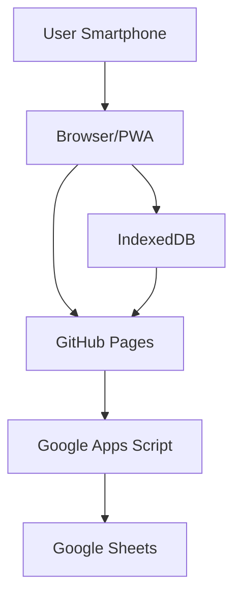

# Sistem Digital Jimpitan Desa

<div align="center">


**Sistem pencatatan jimpitan, hutang, deposit, jadwal petugas, kas, dan laporan keuangan desa**

</div>

---

## 📋 Daftar Isi

- [Tentang Aplikasi](#tentang-aplikasi)
- [Fitur Utama](#fitur-utama)
- [Arsitektur Sistem](#arsitektur-sistem)
- [Role Pengguna](#role-pengguna)
- [Struktur Database](#struktur-database)
- [Prasyarat](#prasyarat)
- [Instalasi](#instalasi)
- [Konfigurasi](#konfigurasi)
- [Penggunaan](#penggunaan)
- [Aturan Bisnis](#aturan-bisnis)
- [Keamanan](#keamanan)
- [Offline Mode](#offline-mode)
- [Pengembangan](#pengembangan)
- [Lisensi](#lisensi)
- [Kontak](#kontak)

---

## 🏠 Tentang Aplikasi

Sistem Digital Jimpitan Desa adalah aplikasi web progresif (PWA) yang dirancang untuk mengotomatisasi proses pencatatan jimpitan (iuran rutin warga desa). Aplikasi ini menggantikan metode manual menggunakan buku dengan sistem digital yang terintegrasi.

### Latar Belakang

Program jimpitan merupakan kegiatan pengumpulan iuran rutin warga desa. Setiap rumah warga memiliki kewajiban membayar jimpitan berdasarkan tarif yang berlaku (misalnya Rp500 per hari). Sistem manual memiliki banyak permasalahan:

- Pencatatan manual rawan salah
- Petugas berbeda setiap hari
- Sulit mengetahui hutang setiap warga
- Deposit warga harus dihitung manual
- Perubahan tarif berpotensi merusak histori
- Laporan harus direkap manual
- Histori tahunan sulit dikelola

Aplikasi ini hadir untuk menyelesaikan semua permasalahan tersebut.

---

## ✨ Fitur Utama

### 1. Manajemen Warga
- CRUD data warga
- Nomor rumah unik
- Status aktif/nonaktif
- Histori tetap tersimpan

### 2. Jadwal Otomatis
- Generate jadwal satu tahun penuh
- Sistem rotasi round-robin
- Regenerate jadwal dari tanggal tertentu
- Jadwal permanen per tahun

### 3. Pencatatan Jimpitan
- Validasi petugas berdasarkan jadwal
- Centang semua / hapus semua
- Live search warga
- Read-only mode untuk bukan petugas
- Validasi backend (bukan hanya frontend)

### 4. Hutang
- Pencatatan hutang otomatis
- Pembayaran hutang dengan metode FIFO
- Pembayaran sebagian
- Hutang lintas tahun (carry forward)

### 5. Deposit
- Pencatatan deposit masuk
- Penggunaan deposit otomatis
- Saldo deposit real-time
- Tidak bisa negatif

### 6. Tarif
- Tarif berdasarkan tanggal aktif
- Snapshot tarif per transaksi
- Perubahan tarif tidak merusak histori

### 7. Kas & Penarikan
- Saldo kas otomatis dari transaksi
- Penarikan kas oleh bendahara/admin
- Penerima harus dari database warga
- Validasi saldo cukup

### 8. Laporan
- Laporan bulanan, tahunan, custom range
- Ringkasan keuangan
- Laporan hutang & deposit
- Cetak PDF

### 9. Offline Mode
- Draft tersimpan di IndexedDB
- Retensi 48 jam
- Recovery setelah HP mati
- Sinkronisasi otomatis

### 10. Audit Trail
- Pencatatan semua aktivitas penting
- Log koreksi
- Riwayat login
- Tidak bisa dihapus

### 11. Multi-Tahun
- Sheet terpisah per tahun
- Opening balance otomatis
- Histori tidak berubah
- Saldo carry forward

### 12. Keamanan
- Password hashing (PBKDF2-style)
- Session token
- Rate limiting login
- Role-based access control
- HTTPS

---

## 🏗 Arsitektur Sistem



### Teknologi yang Digunakan

| Komponen | Teknologi | Keterangan |
|----------|-----------|------------|
| Frontend | HTML, CSS, JavaScript | Responsive, Mobile First |
| Backend | Google Apps Script | API endpoint |
| Database | Google Sheets | Penyimpanan data |
| Offline Storage | IndexedDB | Draft lokal 48 jam |
| Hosting | GitHub Pages | Gratis |
| PWA | Service Worker + Manifest | Installable |

---

## 👥 Role Pengguna

| Role | Deskripsi | Akses Utama |
|------|-----------|-------------|
| **USER** | Warga/petugas jimpitan | Lihat data pribadi, catat jimpitan saat bertugas |
| **BENDAHARA** | Pengelola keuangan | Kelola kas, tarik kas, laporan, bayar hutang |
| **ADMIN** | Pengelola sistem | Semua akses termasuk master data dan monitoring |

### Matriks Hak Akses

| Fitur | User | Bendahara | Admin |
|-------|------|-----------|-------|
| Home/Dashboard | ✓ | ✓ | ✓ |
| Catat Jimpitan | ✓* | ✓ | ✓ |
| Lihat Deposit | ✓ | ✓ | ✓ |
| Lihat Hutang | ✓ | ✓ | ✓ |
| Bayar Hutang | - | ✓ | ✓ |
| Tarik Kas | - | ✓ | ✓ |
| Laporan | - | ✓ | ✓ |
| Data Warga | - | - | ✓ |
| Kelola User | - | - | ✓ |
| Kelola Jadwal | - | - | ✓ |
| Kelola Tarif | - | - | ✓ |
| Monitoring | - | - | ✓ |
| Audit Log | - | - | ✓ |

*User hanya bisa mencatat pada tanggal jadwalnya sendiri

---

## 📊 Struktur Database

### Google Sheets Structure

```
JIMPITAN_DB
│
├── CONFIG              # Konfigurasi sistem
├── USERS               # Data pengguna
├── WARGA               # Data warga
├── TARIF               # Data tarif
├── SALDO_TAHUNAN       # Saldo per tahun
│
├── JADWAL_2026         # Jadwal tahun 2026
├── TRANSAKSI_2026      # Transaksi tahun 2026
├── AUDIT_LOG_2026      # Audit log 2026
│
├── JADWAL_2027         # Jadwal tahun 2027
├── TRANSAKSI_2027      # Transaksi tahun 2027
├── AUDIT_LOG_2027      # Audit log 2027
│
└── ...                 # Tahun berikutnya
```

### Tabel Utama

**USERS**: user_id, username, password_hash, salt, iterations, role, warga_id, status

**WARGA**: warga_id, nama, nomor_rumah, user_id, status, created_at, updated_at

**TARIF**: tarif_id, tanggal_aktif, nominal, created_by, created_at

**JADWAL_YYYY**: jadwal_id, tanggal, warga_id, nama_snapshot, status

**TRANSAKSI_YYYY**: transaksi_id, tanggal, waktu, warga_id, petugas_id, jenis, status, nominal, tarif_id, tarif_snapshot, debt_id, referensi_id, source_year, source_transaction_id, idempotency_key, keterangan, created_by, created_at, updated_at, version

**AUDIT_LOG_YYYY**: audit_id, timestamp, user_id, action, object_type, object_id, old_value, new_value, reason

### Jenis Transaksi

| Jenis | Deskripsi |
|-------|-----------|
| JIMPITAN_PAID | Pembayaran jimpitan lunas |
| JIMPITAN_HUTANG | Pencatatan hutang jimpitan |
| DEPOSIT_MASUK | Deposit warga masuk |
| DEPOSIT_PAKAI | Deposit digunakan untuk bayar |
| HUTANG_PAYMENT | Pembayaran hutang |
| TARIK_KAS | Penarikan kas |
| OPENING_BALANCE_KAS | Saldo awal tahun kas |
| OPENING_BALANCE_HUTANG | Saldo awal hutang |
| OPENING_BALANCE_DEPOSIT | Saldo awal deposit |
| KOREKSI | Koreksi transaksi |

---

## 📦 Prasyarat

### Akun Google
- Akun Google untuk Google Sheets dan Apps Script
- Google Drive untuk penyimpanan

### GitHub
- Akun GitHub untuk hosting frontend
- Git terinstall di komputer (opsional, bisa upload manual)

### Browser
- Chrome/Firefox/Safari terbaru
- Mendukung IndexedDB
- Mendukung PWA (untuk install)

---

## 🔧 Instalasi

### Langkah 1: Setup Google Sheets

1. Buka [Google Sheets](https://sheets.google.com)
2. Buat spreadsheet baru dengan nama `JIMPITAN_DB`
3. Buat sheet berikut:
   - CONFIG
   - USERS
   - WARGA
   - TARIF
   - SALDO_TAHUNAN
   - JADWAL_2026
   - TRANSAKSI_2026
   - AUDIT_LOG_2026

4. Isi header kolom sesuai [Struktur Database](#struktur-database)

### Langkah 2: Setup Google Apps Script

1. Buka spreadsheet → **Extensions** → **Apps Script**
2. Hapus kode default
3. Buat file-file berikut:
   - `Code.gs`
   - `Utils.gs`
   - `Auth.gs`
   - `User.gs`
   - `Warga.gs`
   - `Tarif.gs`
   - `Jadwal.gs`
   - `Transaksi.gs`
   - `Deposit.gs`
   - `Hutang.gs`
   - `Kas.gs`
   - `Laporan.gs`
   - `Monitoring.gs`
   - `Tahun.gs`
   - `Audit.gs`

4. Salin kode dari folder `backend/` di repository ini

### Langkah 3: Deploy Apps Script

1. Klik **Deploy** → **New deployment**
2. Pilih **Web app**
3. Description: `Jimpitan API`
4. Execute as: **Me**
5. Who has access: **Anyone**
6. Klik **Deploy**
7. Salin URL Web App (misal: `https://script.google.com/macros/s/XXXX/exec`)

### Langkah 4: Setup Frontend

1. Clone atau download repository ini
2. Buka `assets/js/api.js`
3. Ganti `YOUR_SCRIPT_ID` dengan ID dari URL Web App:

```javascript
const API_URL = 'https://script.google.com/macros/s/YOUR_SCRIPT_ID/exec';
```

### Langkah 5: Buat User Admin

1. Buka Apps Script editor
2. Jalankan fungsi ini di editor:

```javascript
function createFirstAdmin() {
  const password = 'admin123'; // Ganti dengan password aman
  const result = hashPassword(password, Utilities.getUuid(), 10000);
  console.log('Salt:', result.salt);
  console.log('Hash:', result.hash);
  console.log('Iterations:', result.iterations);
}
```

3. Lihat hasil di Console
4. Masukkan ke sheet USERS secara manual:
   - user_id: `U-ADMIN-001`
   - username: `admin`
   - password_hash: (hasil hash)
   - salt: (hasil salt)
   - iterations: 10000
   - role: `ADMIN`
   - status: `ACTIVE`

### Langkah 6: Hosting di GitHub Pages

1. Buat repository di GitHub
2. Upload semua file frontend
3. Buka **Settings** → **Pages**
4. Source: **Deploy from branch** → `main`
5. Folder: `/ (root)`
6. Klik **Save**
7. Akses aplikasi di `https://username.github.io/repo-name/`

---

## ⚙️ Konfigurasi

### Sheet CONFIG

| Key | Value | Deskripsi |
|-----|-------|-----------|
| `nama_desa` | Desa Sukamaju | Nama desa |
| `tarif_default` | 500 | Tarif default |
| `session_timeout` | 6 | Timeout session (jam) |
| `draft_retention` | 48 | Retensi draft offline (jam) |
| `max_login_attempts` | 5 | Maksimal percobaan login |

### PWA Manifest

File `manifest.json` berisi konfigurasi PWA:

```json
{
  "name": "Jimpitan Desa",
  "short_name": "Jimpitan",
  "theme_color": "#4CAF50",
  "background_color": "#ffffff",
  "display": "standalone"
}
```

---

## 📱 Penggunaan

### User Biasa

1. **Login** dengan username dan password
2. **Dashboard** menampilkan saldo deposit, hutang, dan jadwal
3. **Catat Jimpitan** hanya aktif pada tanggal jadwal sendiri
4. **Akun** untuk melihat riwayat tugas

### Bendahara

1. **Dashboard** menampilkan saldo kas, total hutang, total deposit
2. **Tarik Kas** untuk pengeluaran
3. **Bayar Hutang** dengan FIFO
4. **Laporan** untuk cetak keuangan

### Admin

1. **Data Warga** untuk CRUD warga
2. **Jadwal** untuk generate jadwal tahunan
3. **Tarif** untuk mengubah tarif
4. **Monitoring** untuk statistik
5. **Audit Log** untuk melihat aktivitas

---

## 📏 Aturan Bisnis

### Jadwal
- Satu tanggal memiliki maksimal satu petugas
- Jadwal dibuat satu tahun penuh
- Round-robin berdasarkan urutan warga
- Absen tidak menggeser jadwal
- Regenerate hanya untuk tanggal masa depan

### Jimpitan
- User hanya bisa input pada jadwal sendiri
- Bukan petugas = read-only
- Jadwal masa depan = read-only
- Backend memvalidasi (bukan hanya frontend)

### Tarif
- Perubahan tarif tidak mengubah transaksi lama
- Setiap transaksi menyimpan snapshot tarif
- Tarif aktif berdasarkan tanggal

### Deposit
- Saldo deposit tidak boleh negatif
- Deposit digunakan otomatis untuk pembayaran
- Dihitung dari transaksi (bukan input manual)

### Hutang
- Pembayaran menggunakan FIFO
- Pembayaran sebagian diperbolehkan
- Hutang lintas tahun melalui opening balance
- Tidak bisa membayar melebihi sisa hutang

### Kas
- Penarikan hanya oleh bendahara/admin
- Penerima harus dari database warga
- Saldo tidak boleh negatif
- Semua transaksi tercatat

### Tahunan
- Setiap tahun memiliki sheet terpisah
- Histori tahun sebelumnya tidak diubah
- Saldo akhir menjadi opening balance tahun berikutnya

---

## 🔒 Keamanan

### Password
- Menggunakan SHA-256 dengan salt acak
- Iterasi 10.000 kali (simulasi PBKDF2)
- Tidak pernah disimpan plaintext

### Session
- Token acak (UUID)
- Tersimpan di CacheService
- Expired setelah 6 jam
- Dihapus saat logout

### Rate Limiting
- Maksimal 5 percobaan login gagal
- Blokir 15 menit setelah melebihi

### Validasi
- Backend selalu memvalidasi role
- Validasi kepemilikan data
- Validasi tanggal dan jadwal
- Idempotency untuk mencegah duplikasi

### Transport
- HTTPS (disediakan Google)
- Frontend GitHub Pages juga HTTPS

---

## 📴 Offline Mode

### Cara Kerja

1. Petugas mencatat jimpitan
2. Jika koneksi gagal, data disimpan di IndexedDB
3. Draft berlaku 48 jam
4. Saat koneksi pulih, data dikirim ke server
5. Draft yang berhasil dikirim dihapus

### Recovery

Jika HP mati atau browser tertutup:
1. Buka aplikasi kembali
2. Sistem mendeteksi draft
3. Tampilkan popup untuk memulihkan
4. Lanjutkan pencatatan

---

## 🛠 Pengembangan

### Struktur Folder

```
jimpitan-desa/
│
├── backend/                    # Google Apps Script
│   ├── Code.gs
│   ├── Utils.gs
│   ├── Auth.gs
│   ├── User.gs
│   ├── Warga.gs
│   ├── Tarif.gs
│   ├── Jadwal.gs
│   ├── Transaksi.gs
│   ├── Deposit.gs
│   ├── Hutang.gs
│   ├── Kas.gs
│   ├── Laporan.gs
│   ├── Monitoring.gs
│   ├── Tahun.gs
│   └── Audit.gs
│
├── frontend/                   # GitHub Pages
│   ├── index.html
│   ├── manifest.json
│   ├── service-worker.js
│   ├── assets/
│   │   ├── css/
│   │   │   └── style.css
│   │   ├── js/
│   │   │   ├── api.js
│   │   │   ├── auth.js
│   │   │   ├── app.js
│   │   │   ├── storage.js
│   │   │   └── ...
│   │   └── icons/
│   │       ├── icon-192x192.png
│   │       └── icon-512x512.png
│   └── pages/
│       ├── user/
│       ├── bendahara/
│       └── admin/
│
├── docs/                       # Dokumentasi
│   └── SRS.md
│
└── README.md
```

### Prioritas Implementasi

1. **Phase 1**: Database, Authentication, Role, Master Warga
2. **Phase 2**: Tarif, Jadwal otomatis, Jimpitan
3. **Phase 3**: Hutang, Pembayaran Hutang, Deposit
4. **Phase 4**: Kas, Tarik Kas, Bendahara
5. **Phase 5**: Admin, Monitoring, Koreksi + Audit
6. **Phase 6**: Saldo Tahunan, Carry Forward, Generate Tahun Baru
7. **Phase 7**: Laporan, PDF, Dashboard
8. **Phase 8**: PWA, IndexedDB, Offline Draft, Notification

### Testing

Sebelum deploy, pastikan:

- [ ] Login berhasil
- [ ] Role diterapkan dengan benar
- [ ] Generate jadwal berhasil
- [ ] Catat jimpitan berhasil
- [ ] Validasi petugas bekerja
- [ ] Deposit otomatis bekerja
- [ ] Hutang FIFO bekerja
- [ ] Tarik kas bekerja
- [ ] Laporan benar
- [ ] Offline draft bekerja
- [ ] Pergantian tahun bekerja
- [ ] Audit log tercatat

---

## 📄 Lisensi

MIT License

Copyright (c) 2026 Sistem Digital Jimpitan Desa

Permission is hereby granted, free of charge, to any person obtaining a copy
of this software and associated documentation files (the "Software"), to deal
in the Software without restriction, including without limitation the rights
to use, copy, modify, merge, publish, distribute, sublicense, and/or sell
copies of the Software, and to permit persons to whom the Software is
furnished to do so, subject to the following conditions:

The above copyright notice and this permission notice shall be included in all
copies or substantial portions of the Software.

THE SOFTWARE IS PROVIDED "AS IS", WITHOUT WARRANTY OF ANY KIND, EXPRESS OR
IMPLIED, INCLUDING BUT NOT LIMITED TO THE WARRANTIES OF MERCHANTABILITY,
FITNESS FOR A PARTICULAR PURPOSE AND NONINFRINGEMENT. IN NO EVENT SHALL THE
AUTHORS OR COPYRIGHT HOLDERS BE LIABLE FOR ANY CLAIM, DAMAGES OR OTHER
LIABILITY, WHETHER IN AN ACTION OF CONTRACT, TORT OR OTHERWISE, ARISING FROM,
OUT OF OR IN CONNECTION WITH THE SOFTWARE OR THE USE OR OTHER DEALINGS IN THE
SOFTWARE.

---

## 🙏 Kontribusi

Kontribusi sangat diterima! Silakan fork repository ini dan buat pull request.

---

## 📞 Kontak

**Pengembang:**

**Rizky Hanifudin, S.Kom., M.Kom.**

📱 WhatsApp: [085869788917](https://wa.me/6285869788917)

Jika ada pertanyaan atau masalah, silakan:
- Buat issue di repository GitHub
- Hubungi via WhatsApp

---

<div align="center">

**Dibuat dengan ❤️ untuk kemajuan desa**

**© 2026 Rizky Hanifudin, S.Kom., M.Kom.**

</div>
```

---
